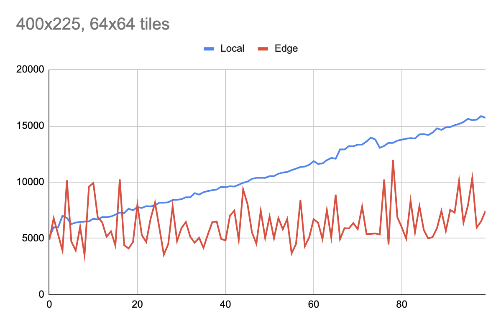
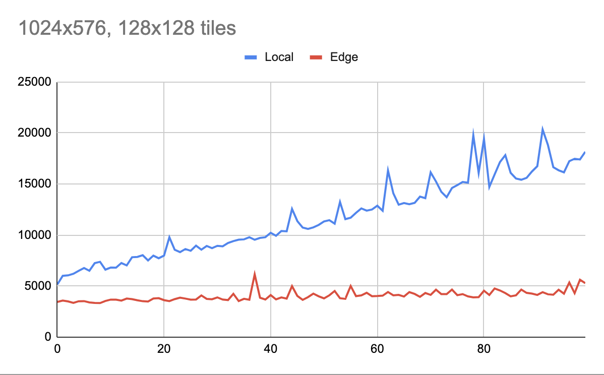
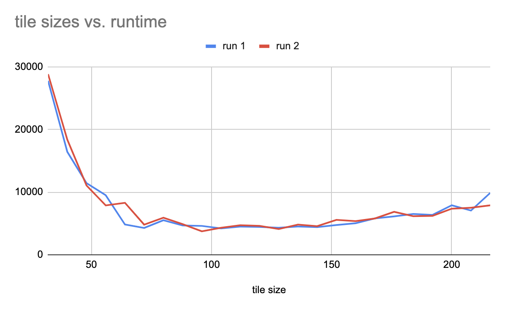

# Ray Tracing at the Edge

## Premise

This repo is a prototype of a ray tracer based on [Ray Tracing in a Weekend](https://raytracing.github.io/books/RayTracingInOneWeekend.html)

My intention is to use this to test assumptions and do analysis on whether it would be feasible and worthwhile to pursue this idea further. If the results look positive, I will probably port [pbrt](pbrt.org) to Rust and apply a similar model.

Currently this is a local CLI version that uses [Edgetracer-Wasm](https://github.com/justinliew/edgetracer-wasm) as the C@E version.
Use `copy_to_wasm.sh` to copy the relevant files to that repo for build/deploy.

The general idea is to break the ray tracing into tiles, and then make tile rendering thread safe.
Then I can test tile rendering in various incarnations:
- single threaded locally
- multithreadeded locally
- C@E

I will try different scene complexities, tile sizes, and see what timing looks like.

## Theories

Anecdotal results are showing that complexity plays a part - the more complex a scene, the more CPU time is required, and the better this scales especially to C@E. I am currently using "number of objects" as a way to change complexity. Adding more complex materials and features would also increase this but as a prototype the easiest way is to add objects.

A tile size of 64 seems like a good compromise. The original author picked 16x16 for the local version but it appears the http overhead for that number of requests overwhelms any savings. This might be relative to the size of the image (currently 400 wide at a 16x9 aspect ratio)

## Tests

I ran 3 tests comparing local and edge computed ray tracing. The first was a 400x225 sized image with 0-99 metal spheres and 64x64 tiles. The second was 1024x576 with similar complexity, but with 128x128 tiles. The last one varied tile size for edge compute.

It is clear from these graphs that more complex scenes benefit from doing some compute at the edge, and that an ideal tile dimension is somewhere between 85 and 140.